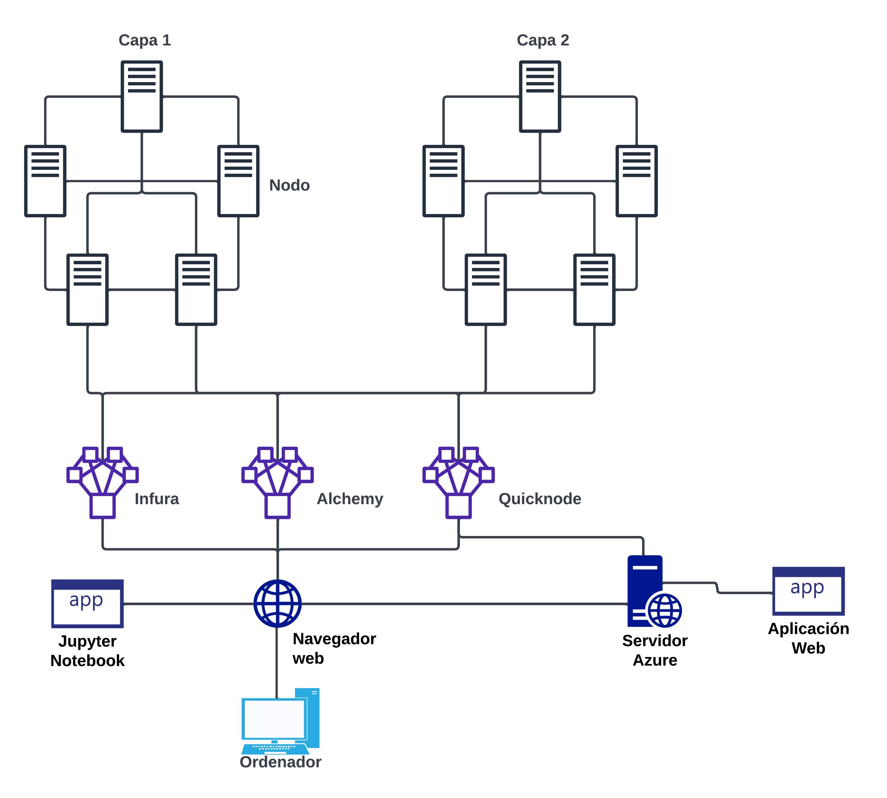
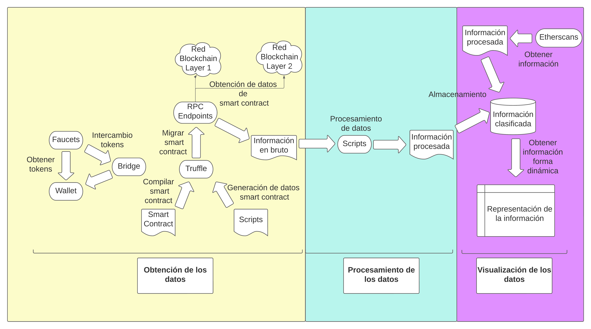

# Trabajo Fin de Master de Pablo Ruiz Giles


En este estudio, nos centraremos en la tecnología de Layer 2 y sus ventajas en comparación con las de Layer 1. Comenzaremos describiendo los distintos tipos de esta novedosa tecnología y analizaremos las redes Blockchain implementadas en cada uno de ellos. Posteriormente, realizaremos un estudio práctico mediante el despliegue de un escenario en distintas redes Blockchain de Layer2 para comparar los parámetros que caracterizan a esta tecnología. El objetivo de este estudio práctico es observar las mejoras en el rendimiento entre los diferentes tipos de Layer 2.

El análisis que se pretende realizar contempla una componente teórica y otra práctica. La primera nos permitirá entender mejor la tecnología Layer 2 y sus aplicaciones en el mundo de la tecnología Blockchain. El estudio práctico nos permitirá ver en acción las mejoras en el rendimiento que ofrece esta tecnología. Al final, este estudio nos permitirá tener una comprensión más profunda y completa de la tecnología Layer 2 y su potencial en el futuro inmediato.


## Tabla de contenidos
- [Requisitos](#requisitos)
- [Instalación](#instalación)
- [Arquitectura física y lógica](#arquitectura-física-y-lógica)
- [Estructura de directorios](#estructura-de-directorios)
- [Contacto](#contacto)


## Requisitos

Los requisitos previos que se necesitan para poder ejecutar el siguiente proyecto son lo siguientes:

Para poder utilizar las RPC Endpoints y faucets que ofrecen las plataformas de Infura, Alchemy y Quickcnode es necesario tener una cuenta activa en cada una de ellas. Asimismo, es necesario clonar el proyecto desde su repositorio en GitHub para poder trabajar con él.

Además, para llevar a cabo los procesos de la fase de Obtención de datos, es indispensable contar con la instalación previa de Truffle. También es necesario disponer de una cuenta en Metamask, lo que permitirá contar con una wallet para almacenar los tokens y realizar transacciones.

Otro requisito importante es tener instalado npm, que es el gestor de paquetes de Node.js. Asimismo, para ejecutar los distintos notebooks es necesario contar con la instalación de Jupyter.

Por otro lado, para ejecutar los scripts de tipo bash es necesario disponer de un sistema operativo Linux o de un emulador que permita ejecutarlos. Finalmente, es necesario contar con la instalación de HDWalletProvider, que puede ser instalado fácilmente mediante el gestor de paquetes npm.


## Instalación

Para la instalación de este estudio, únicamente será necesario seguir los siguientes pasos.

1. Clona el repositorio en tu máquina local:
```
git clone https://github.com/Pablo-Ruiz-Giles1/TFM.git
```

2. Navega al directorio raíz del proyecto:
```
cd TFM
```

Una vez dentro de la carpeta raíz, podremos explorar el proyecto en su totalidad, pudiendo ejecutar los scripts y visualizar los notebooks.

Para visualizar los notebooks, dirijase a la carpeta de los notebooks y ejecute.
```
jupyter notebook
```

## Arquitectura física y lógica

A continuación, se detallan las especificaciones tanto de la arquitectura física como de la arquitectura lógica del proyecto.

### Arquitectura física

La arquitectura física del proyecto se compone de los siguientes elementos, cada uno con sus respectivas especificaciones:

- Ordenador:
  - RAM: Se requiere un mínimo de 16 GB de RAM para garantizar un rendimiento óptimo durante el proceso de análisis y comparación de las capas blockchain.
  - Almacenamiento: Se recomienda contar con al menos 512 GB de espacio de almacenamiento para almacenar los datos y registros generados durante el estudio.
  - Tarjeta gráfica: Es necesario disponer de una tarjeta gráfica moderna y compatible con las tecnologías utilizadas en el proyecto para realizar cálculos y visualizaciones necesarias.

- Nodos RPC endpoints:
  - Capacidad de transacciones: Los nodos utilizados en el experimento deben ser capaces de realizar al menos 100,000 transacciones o llamadas al día. Esta capacidad es fundamental para llevar a cabo un análisis exhaustivo de las capas blockchain.

- Servidor Azure:
  - Tamaño del servidor: Se recomienda utilizar un servidor de tamaño *Standard D2s v3* en Azure, el cual ofrece un equilibrio adecuado entre rendimiento y costo.
  - Recursos de hardware: El servidor debe contar con 2 vCPUs (unidades de procesamiento virtual) y 8 GiB de RAM para manejar eficientemente las operaciones requeridas por el experimento.
  - Sistema operativo: Se utiliza un sistema operativo Linux, específicamente la versión *0001-com-ubuntu-server-jammy* de la oferta *canonical* con el plan *22_04-lts-gen2*.
  - Arquitectura de la máquina virtual: La VM debe tener una arquitectura x64, la cual es compatible con la mayoría de los sistemas operativos y aplicaciones modernas.



### Arquitectura lógica

La arquitectura lógica del proyecto se basa en las siguientes fases:


 - **Obtención de datos**: En esta etapa se desarrollará un smart contract escrito en Solidity, que se desplegará en las diferentes redes de pruebas para realizar transacciones. Se crearán scripts para generar transacciones de forma secuencial y paralela, evaluando la capacidad de la red para procesar transacciones simultáneas.

 - **Procesamiento de datos**: En esta etapa se analizarán y manipularán los datos obtenidos en la etapa anterior. Se emplearán scripts específicos que se adaptarán al tipo de datos secuenciales o paralelos. Se generarán archivos en formato CSV que contendrán la información relevante para el estudio.

 - **Visualización de datos**: Los archivos generados en la fase anterior se exportarán a un diccionario de dataframes para facilitar la manipulación y análisis de los datos. Se realizarán modificaciones en las columnas de los dataframes y se exportarán archivos CSV de los Etherscan descargados de las redes probadas. La visualización final proporcionará una comprensión clara de los datos, facilitando la toma de decisiones y la extracción de conclusiones precisas.

A continuación, se muestra el diagrama de flujo del proyecto:



En el diagrama de flujo se representa de forma sencilla la secuencia de las etapas mencionadas anteriormente.

## Estructura de directorios

Dentro de la estructura de directorios del proyecto, se pueden distinguir cuatro carpetas principales, cada una con sus respectivas funciones:

1. Carpeta **Proyectos**: Esta carpeta contiene todos los elementos necesarios para el desarrollo de la primera fase del proyecto. A continuación, se detallan los componentes incluidos en esta carpeta:
   - Carpeta **Contracts**: Contiene el smart contract "Entrada.sol", el cual se utilizará para llevar a cabo pruebas en diferentes redes blockchain.
   - Carpeta **Migrations**: Contiene el archivo "deploy", utilizado para migrar el contrato mencionado anteriormente.
   - Carpeta **Scripts**: Aquí se encuentran los distintos scripts que se utilizarán para realizar las pruebas necesarias.
   - Carpeta **Build**: Almacena el smart contract compilado.
   - Archivo **truffle-config**: Contiene todas las configuraciones necesarias para las diferentes redes blockchain utilizadas en las pruebas.

2. Carpeta **Datos volcados**: Esta carpeta cuenta con dos subdirectorios fundamentales para el procesamiento de archivos de texto en bruto. A continuación, se describen los subdirectorios incluidos:
   - Carpeta **Secuencial**: Contiene los scripts utilizados para procesar los datos de tipo secuencial.
   - Carpeta **Paralelo**: Contiene los scripts utilizados para procesar los datos de tipo paralelo y eliminado.

3. Carpeta **Notebooks**: Esta carpeta contiene todos los elementos necesarios para la última fase del proyecto, la fase de visualización de datos. A continuación, se detallan los componentes incluidos:
   - Carpeta **datos**: Contiene cuatro subdirectorios (eliminar, secuencial, paralelo y scan), donde se encuentran los datos procesados durante la etapa previa. Estos subdirectorios son esenciales para la correcta visualización de los datos en la fase final del proyecto.
   - Carpeta **Notebooks**: Contiene los notebooks desarrollados para procesar y visualizar los datos.

4. Carpeta **Propuesta**: Esta carpeta contiene todos los elementos necesarios para poder realizar la propuesta de práctica.

La estructura de archivos descrita anteriormente permite organizar de manera clara los diferentes componentes del proyecto, facilitando su acceso y mantenimiento.


## Contacto

Este trabajo se ha realizado como proyecto de fin de máster de la Politécnica de Madrid por Pablo Ruiz Giles. Para más información ponerse en contacto a través de la cuenta de correo electrónico p.rgiles@alumnos.upm.es.


